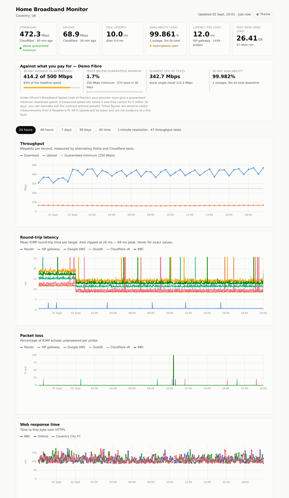

# home-broadband

Continuous broadband quality monitoring from a Raspberry Pi, published as a
static site on GitHub Pages.

A Pi wired to your router measures **throughput**, **round-trip latency**,
**packet loss**, **DNS resolution time** and **web response time** against a
configurable list of hosts, stores every sample in SQLite, and pushes a compact
JSON snapshot to a GitHub Pages branch on a schedule. The dashboard is plain
HTML and JavaScript with no build step and no third-party requests.

> Live example: **https://home-broadband.coldwire.uk**



---

## What it measures

| Signal | How | Default cadence |
|---|---|---|
| Download / upload throughput | Three engines in rotation: official Ookla CLI, Debian's `speedtest-cli`, and Cloudflare's edge | hourly |
| Round-trip latency, jitter, packet loss | 5 ICMP echoes per target via the system `ping` | every 60 s |
| DNS resolution time | dnspython query against each named resolver (falls back to `dig`) | every 60 s |
| Web response time | `curl` timing split: DNS / TCP / TLS / time-to-first-byte | every 60 s |
| WAN outages | derived: every non-LAN target unreachable in the same sweep | continuous |

### The three throughput engines

Rotating engines is deliberate: when they disagree, the bottleneck is usually
the test path or the Pi itself rather than your line — which is exactly the
argument an ISP will make, so it is worth being able to answer it.

| Engine | Install | Reports | Notes |
|---|---|---|---|
| `ookla` | Ookla's apt repo | bytes/s | The number an ISP will accept, and the only one that yields a `speedtest.net` result URL. **No armhf packages** — unavailable on 32-bit Raspberry Pi OS. |
| `speedtest-cli` | `apt install speedtest-cli` | bits/s | Debian's Python client. Also hits speedtest.net and installs anywhere, but it is CPU-bound on a Pi and under-reports above roughly 200 Mbps. No jitter or loss figures. |
| `cloudflare` | nothing | measured here | Implemented directly against `speed.cloudflare.com`, with a warm-up window so TCP slow start is not averaged into the result. |

The two speedtest.net clients report throughput in **different units** — bytes
per second for Ookla, bits per second for `speedtest-cli`. Confusing them is an
8× error, so the conversion lives in one place per engine and both are pinned to
the same line speed in the test suite.

List whichever you have; `install.sh` writes the list based on what it managed
to install:

```yaml
speed:
  engines: [ookla, speedtest-cli, cloudflare]   # rotated round-robin
```

## How it fits together

```
Raspberry Pi (wired to the router)
├── systemd timers
│   ├── broadband-latency.timer   every minute   ── ICMP / DNS / HTTP sweep
│   ├── broadband-speed.timer     hourly         ── Ookla → speedtest-cli → Cloudflare
│   ├── broadband-publish.timer   hourly         ── aggregate + push
│   └── broadband-prune.timer     daily          ── retention
│
├── /var/lib/broadband-monitor/broadband.db      ── SQLite, system of record
│
└── publish ── column-wise JSON ── git push --force ──► GitHub  gh-pages branch
                                                              │
                                              GitHub Pages ───┴──► your domain
```

**Nothing is exposed on your network.** The Pi makes only outbound
connections; there is no listener, no port forward and no inbound tunnel.

## Quick start

On a Raspberry Pi running Raspberry Pi OS (Bookworm or later), **wired to the
router over Ethernet** — Wi-Fi measurements tell you about Wi-Fi, not your line:

```bash
# 1. Create an empty repo on GitHub (e.g. mmorrow24work/home-broadband), then:
git clone https://github.com/mmorrow24work/home-broadband.git ~/git/broadband-monitor
cd ~/git/broadband-monitor
sudo ./scripts/install.sh --in-place
```

`--in-place` runs the service straight out of your clone, so there is one copy
of the code and `git pull` in that directory is the update. Omit it and the
installer copies everything to `/opt/broadband-monitor` instead — tidier, but
then the checkout you edit and the code that runs are two different trees.
`--app-dir PATH` puts it anywhere else. See
[docs/INSTALL.md § Where the code lives](docs/INSTALL.md#where-the-code-lives).

The installer prints an SSH deploy key. Add it to the repo under
**Settings → Deploy keys → Add deploy key**, tick **Allow write access**, then
edit the config and let the timers run:

```bash
sudo nano /etc/broadband-monitor/config.yaml     # remote, domain, targets, ISP speeds
sudo systemctl start broadband-publish.service   # first publish
journalctl -u broadband-publish -n 30 --no-pager
```

Finally set **Settings → Pages → Source = Deploy from a branch → `gh-pages` /
(root)**. Full walkthrough including DNS: **[docs/INSTALL.md](docs/INSTALL.md)**.

### Preview the dashboard before the Pi has any data

```bash
python3 -m venv .venv && .venv/bin/pip install -r requirements.txt
.venv/bin/python scripts/seed_demo.py --days 10 --serve   # → http://localhost:8000
```

## Configuration

Everything lives in `/etc/broadband-monitor/config.yaml`; the shipped
[`config/config.example.yaml`](config/config.example.yaml) documents every key
inline. The part you will actually edit is the target list:

```yaml
latency:
  interval_seconds: 60
  targets:
    - name: "Router"            # label on the dashboard
      host: "192.168.1.1"       # hostname or literal IP
      group: "lan"              # lan | isp | internet | custom
      checks: [icmp]

    - name: "ISP gateway"
      host: "1.1.1.1"
      group: "isp"
      checks: [icmp]
      primary: true             # drives the headline latency tile

    - name: "Cloudflare v6"
      host: "2606:4700:4700::1111"
      family: ipv6              # auto | ipv4 | ipv6
      checks: [icmp]

    - name: "BBC"
      host: "www.bbc.co.uk"
      checks: [icmp, dns, http]
      url: "https://www.bbc.co.uk/"

    - name: "Claude API"        # a service you depend on, not just the internet
      host: "api.anthropic.com"
      checks: [dns, http]
      url: "https://api.anthropic.com/"
      expect_status: [200, 400, 401, 403, 404, 405]
```

`expect_status` matters for anything that answers an unauthenticated probe with
a non-2xx code — `api.anthropic.com` returns 404 at `/`, `claude.ai` returns 403
to a bare request. Both prove the edge answered; without this they would sit
permanently red and tell you nothing when the service actually broke. It takes
an int, a `"NNN-NNN"` range, or a list of either, and defaults to `200-399`.

Add or remove targets freely — the dashboard, the colour assignments and the
outage logic all follow this list. Including a **LAN target** matters: when the
gateway answers and everything beyond it does not, the fault is upstream of your
house, and the dashboard only calls something an outage when every *non-LAN*
target is unreachable in the same sweep.

The config is validated on load, so a typo fails immediately with a pointer to
the offending entry rather than producing quietly wrong data.

## Data usage

Throughput tests move real bytes. On a 500 Mbps line:

| Engine | Per test | Notes |
|---|---|---|
| Ookla | ≈ 0.85 GB | duration-based; scales with your line speed |
| speedtest-cli | ≈ 0.6 GB | duration-based, but slower so it moves less |
| Cloudflare | ≈ 0.35 GB | byte-capped by `speed.cloudflare.*` |

With all three engines rotating:

| `interval_minutes` | Tests/day/engine | Roughly per day | Per month |
|---|---|---|---|
| 60 (default) | 8 | ≈ 15 GB | ≈ 450 GB |
| 30 | 16 | ≈ 30 GB | ≈ 900 GB |
| 120 | 4 | ≈ 7 GB | ≈ 220 GB |

Fine on unlimited fibre; check first if you are on a capped or metered
connection. Three controls exist:

* `speed.max_daily_gb` — hard guard, skips tests once the day's total is hit.
* `speed.quiet_hours` — skip the evening peak if a saturated uplink annoys people.
* `speed.engines: [cloudflare]` — by far the cheapest engine on its own.

Latency probing is negligible: 5 ICMP echoes per target per minute is a few MB
a day.

## Why the published branch is force-pushed

The Pi's SQLite database is the system of record; the published JSON is a
derived view. So the publisher rewrites `gh-pages` as a **single orphan commit**
each time and force-pushes it. A monitor writing hourly for three years would
otherwise leave 26,000 commits and a repo far larger than the data it holds.
This way the repo stays the size of one snapshot — about **17 MB after a year**
— forever, and `main` keeps a clean human history of the code alone.

Set `publish.squash: false` if you would rather keep the history.

## Where the data lives

**Only on the `gh-pages` branch, under `data/`.** The `main` branch holds code
and never contains a single measurement — `site/data/` is gitignored there.

```
gh-pages/
├── index.html, app.js, style.css, vendor/   the dashboard, copied from main's site/
├── CNAME                                    site.domain, rewritten every publish
├── .nojekyll                                stops GitHub's Jekyll eating data/
└── data/
    ├── manifest.json      targets, timezone, ISP, link speed, index of available days
    ├── summary.json       24 h / 7 d / 30 d / all-time headline stats and outages
    ├── latest.json        the last `latest_hours` at full probe resolution
    ├── daily/YYYY-MM-DD.json    one file per day, `bucket_seconds` buckets
    └── monthly/YYYY-MM.json     one file per month, hourly buckets
```

Sizes, measured against an eleven-target config — they scale with how many
targets you probe, so a smaller list is proportionally smaller:

| File | Contents | Size |
|---|---|---|
| `data/latest.json` | 48 h at 1-minute resolution | ≈ 600 kB (~100 kB gzipped) |
| `data/daily/YYYY-MM-DD.json` | one day at 5-minute buckets | 40–100 kB |
| `data/monthly/YYYY-MM.json` | one month at hourly buckets | ≈ 10 kB |
| `data/summary.json` | headline stats across four windows | ≈ 3 kB |
| `data/manifest.json` | config + index of days and months | ≈ 2 kB |

JSON is written column-wise (`{"t": [...], "rtt": [...]}`) rather than as an
array of objects — roughly a 4× saving over the naive layout, and faster to
parse in the browser.

Inspect the live data without cloning anything — the `days` array in the
manifest lists every daily file that exists:

```bash
curl -s https://your-domain/data/manifest.json | python3 -m json.tool
curl -s https://your-domain/data/summary.json  | python3 -m json.tool
```

Because the branch is rewritten as one orphan commit, `git log gh-pages` will
only ever show a single entry. And because it is derived, losing the whole
branch costs nothing but a republish: the authoritative record is the SQLite
database on the Pi, which keeps every raw sample for `database.retention_days`
(three years by default). Want finer resolution published? Change
`publish.bucket_seconds` or `latest_hours` and republish — it regenerates from
the database.

## The dashboard

Vanilla HTML, CSS and JavaScript with [uPlot](https://github.com/leeoniya/uPlot)
vendored into `site/vendor/`. No build step, no CDN, no analytics, no cookies —
GitHub Pages serves exactly what is in the branch.

* Time ranges of 24 h / 48 h / 7 d / 30 d / all, each backed by the appropriate
  resolution so a year of history still loads in one request per month.
* Crosshair tooltips, a clickable legend, dark and light themes.
* A target keeps the **same colour in every chart**, so a spike in the latency
  chart and a spike in the loss chart are visibly the same host.
* The latency axis clips at the 99.5th percentile and says so, rather than
  letting three outliers flatten the everyday band into a straight line.
* An **Ofcom panel**: 30-day average against the advertised speed, the share of
  tests below the guaranteed minimum, the slowest 10%, and availability. Under
  the Broadband Speed Code of Practice this is the evidence that matters if you
  ever need to leave a contract over speed.

The palette is checked against the OKLab colour-vision-deficiency separation and
contrast gates in both themes; see [docs/DESIGN.md](docs/DESIGN.md).

## Command line

`python -m` resolves the package from the working directory, so run these from
the install directory:

```bash
cd ~/git/broadband-monitor        # or /opt/broadband-monitor
RUN="sudo -u broadband .venv/bin/python -m collector.main"

$RUN status                          # what has been collected
$RUN latency --dry-run               # probe once, print, store nothing
$RUN speed --force                   # test now with the next engine, ignore guards
$RUN speed --force --engine speedtest-cli   # or ookla / cloudflare
$RUN servers                         # find a speedtest server worth pinning
$RUN publish --dry-run               # build the site, do not push
$RUN prune                           # apply retention
```

The database is plain SQLite — `sqlite3 /var/lib/broadband-monitor/broadband.db`
and query it directly for anything the dashboard does not show.

## Repository layout

```
collector/          the Python collector
  config.py         schema, defaults, validation
  db.py             SQLite schema and helpers
  publish.py        aggregation, JSON export, git push
  probes/           ping, dns, http, ookla, speedtest_cli, cloudflare
site/               the dashboard (published as-is)
systemd/            service + timer units
scripts/            install.sh, uninstall.sh, seed_demo.py
config/             the documented example config
tests/              pytest suite (parsers, config, export, outage logic)
docs/               install runbook, operations, design notes
```

## What it can and cannot tell you

Worth being clear before you draw conclusions from it, because the collector's
own hardware bounds part of what it measures.

**Always trustworthy, on any Pi:** round-trip latency and jitter, packet loss,
DNS resolution time, HTTP time-to-first-byte *as a trend*, and outage detection.
These are the measurements that actually catch a line misbehaving, and none of
them care how fast the Pi's network card is.

**Bounded by the collector:** throughput. A 100 Mbit NIC caps TCP at roughly
94 Mbps in each direction no matter what your line does, so on a fast connection
the figure becomes a floor rather than a measurement. The dashboard says so —
the Download tile is labelled, and the Ofcom panel compares against the link
ceiling instead of your package — but it is a real limit, not a display quirk.

**Distorted by the Pi's CPU:** the ping figure inside a throughput result (it is
HTTP-based, and TLS on a slow core inflates it — use the latency chart instead),
and absolute TTFB values. On an ARMv7 core these read high; the *shape* over time
is still meaningful.

## Requirements

### Hardware

Any Pi runs the collector. Which one you pick decides only the throughput
ceiling:

| Board | Ethernet | Usable throughput |
|---|---|---|
| Pi 1, 2, 3, Zero 2 W | 100 Mbit | ≈ 94 Mbps |
| Pi 3B+ | Gigabit over USB 2.0 | ≈ 230 Mbps |
| Pi 4, 5, CM4 | true Gigabit | ≈ 940 Mbps |

Check what you have with `cat /proc/device-tree/model` and confirm the
negotiated speed with `cat /sys/class/net/eth0/speed`. Note that only the Pi 3
and later can run 64-bit Raspberry Pi OS, and 64-bit is what the official Ookla
client needs — a Pi 1 or 2 is `armhf` forever.

### Software

* A systemd-based Debian derivative, on **Ethernet** — Wi-Fi measures Wi-Fi
* Python 3.9+
* `iputils-ping`, `curl`, `git`, `dnsutils` — installed by `install.sh`
* At least one throughput engine — `install.sh` sets up whichever are available:
  `speedtest-cli` from apt (anywhere), the official Ookla CLI (amd64/arm64 only),
  and Cloudflare (needs nothing)
* A GitHub repository you can add a deploy key to

## Licence

MIT — see [LICENSE](LICENSE).
